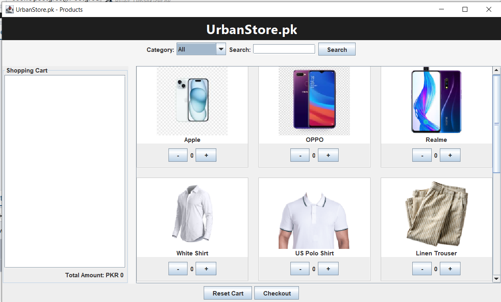
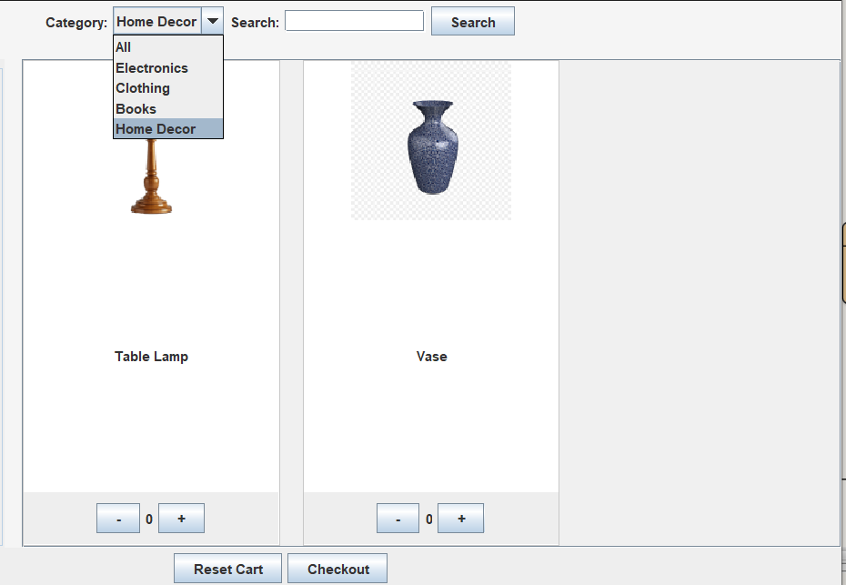
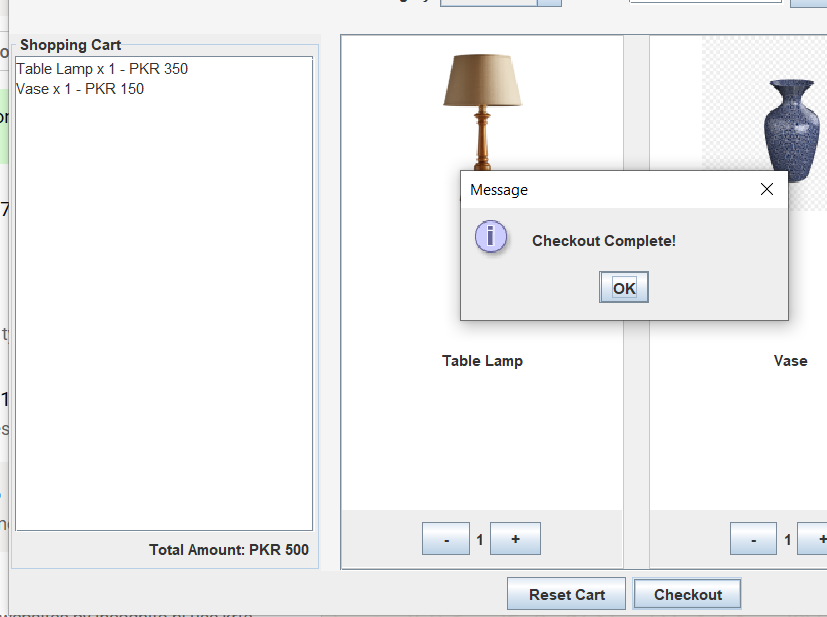
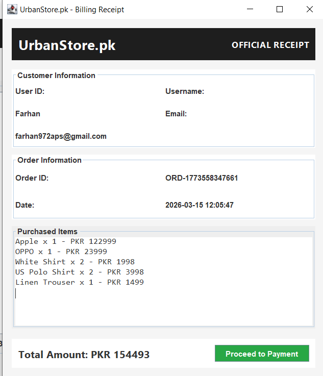

# urbanstore.pk – Java Desktop E-Commerce System

[](https://www.java.com/)
[](https://docs.oracle.com/javase/tutorial/uiswing/)
[](https://www.bluej.org/)
[](https://www.postgresql.org/)
[](#license)

urbanstore.pk is a **Java Swing based desktop e-commerce application** that allows users to browse products, add items to a cart, manage quantities, and checkout with a billing interface.

This project demonstrates the use of **Java Swing GUI, object-oriented programming, event handling, and simple cart management logic**.

---

## 📸 Screenshots

### Main Dashboard


### Product Browsing


### Shopping Cart


### Billing Dashboard


---

## ✨ Features

- ✅ urbanstore.pk branded desktop interface
- ✅ Product browsing with images
- ✅ Category filtering (Electronics, Clothing, Books, Home Decor)
- ✅ Product search bar
- ✅ Product hover UI effects
- ✅ Quantity selector (+ / −) for each product
- ✅ Live cart price updates
- ✅ Reset cart functionality
- ✅ Checkout and billing dashboard
- ✅ PKR (Pakistani Rupee) pricing support

---

## 🛠 Technologies Used

| Category | Details |
|----------|---------|
| **Language** | Java (JDK 8 or higher) |
| **GUI Framework** | Java Swing |
| **IDE (Recommended)** | BlueJ / IntelliJ IDEA |
| **Database** | PostgreSQL |
| **Build Tool** | Java Compiler |

### Libraries Used:
```
• javax.swing
• java.awt
• java.util
• javax.imageio
• java.sql (PostgreSQL JDBC)
```

---

## 📁 Project Structure

```
UrbanStore/
│
├── assets/
│   ├── products/
│   │   ├── ph1.jfif
│   │   ├── ph2.jpg
│   │   ├── rel.jfif
│   │   ├── samsung-1283938_1280.jfif
│   │   ├── clt1.png
│   │   ├── us.png
│   │   ├── tr.png
│   │   ├── jav.jpg
│   │   ├── download.png
│   │   ├── pyt.png
│   │   ├── tl.png
│   │   └── vs.jpg
│   └── screenshots/
│       ├── dashboard.png
│       ├── products.png
│       ├── cart.png
│       └── billing.png
│
├── src/
│   ├── UserDashboard.java
│   ├── BillingDashboard.java
│   ├── LoginFrame.java
│   └── other files here....│
├── README.md
└── LICENSE
```

**Directory Description:**
- `assets/products/` - Contains all product images used in the application
- `assets/screenshots/` - Project demo screenshots
- `src/` - Java source code files

---

## 🚀 Quick Start

### Prerequisites
- **Java JDK 8** or higher installed
- **PostgreSQL** database
- **BlueJ** or **IntelliJ IDEA** (optional, can use command line)

### Installation Steps

#### Step 1: Clone the Repository
```bash
git clone https://github.com/FarhanAshraf-DEV/urbanstore.git
cd urbanstore
```

#### Step 2: Install PostgreSQL
Download and install PostgreSQL from [postgresql.org](https://www.postgresql.org/download/)

#### Step 3: Create Database
Open PostgreSQL and run:
```sql
CREATE DATABASE ecom;
```

#### Step 4: Create Users Table
```sql
CREATE TABLE users (
    id SERIAL PRIMARY KEY,
    username VARCHAR(100) NOT NULL,
    password VARCHAR(255) NOT NULL,
    email VARCHAR(150),
    mobile_number VARCHAR(15),
    dob DATE,
    address TEXT,
    pincode INTEGER
);
```

#### Step 5: Setup PostgreSQL JDBC Driver

**Download PostgreSQL JDBC Driver:**
- Visit: [jdbc.postgresql.org](https://jdbc.postgresql.org/download/)
- Download: `postgresql-42.x.x.jar`

**Add to Project:**

**For BlueJ:**
1. Project → Preferences → Libraries
2. Add the PostgreSQL JDBC JAR file
3. Click OK

**For IntelliJ:**
1. File → Project Structure → Libraries
2. Click + → Java
3. Select the JAR file

#### Step 6: Install Java JDK
Download from [java.com](https://www.java.com/) or [oracle.com](https://www.oracle.com/java/technologies/downloads/)

---

## 💻 How to Run the Project

### Using BlueJ (Easiest Method)

1. **Open BlueJ**
2. Click: `Project → Open Project Folder`
3. Select the urbanstore folder
4. Wait for classes to compile
5. Right-click on **`LoginFrame.java`** class
6. Select: `void main(String[] args)`
7. ✅ The application will launch!

### Using Command Line

```bash
# Navigate to project directory
cd urbanstore

# Compile all Java files
javac *.java

# Run the application
java -cp src:postgresql-42.x.x.jar src.LoginFrame
```

### Using IntelliJ IDEA

1. Open IntelliJ IDEA
2. File → Open → Select urbanstore folder
3. Wait for indexing to complete
4. Right-click on `loginframe.java`
5. Select "Run loginframe.main()"

---

## 🎮 How to Use the Application

1. **Login/Registration** - Create a new account or login
2. **Browse Products** - Navigate through different categories
3. **Search Products** - Use the search bar to find items
4. **Add to Cart** - Click products to add them
5. **Adjust Quantity** - Use +/− buttons to modify quantities
6. **View Cart** - See all items and total price
7. **Checkout** - Proceed to billing dashboard
8. **Review Invoice** - See itemized billing summary

---

## 📊 Database Schema

### users table
```
id (INTEGER) - Primary Key, Auto-increment
username (VARCHAR) - Unique username
password (VARCHAR) - Encrypted password
email (VARCHAR) - User email
mobile_number (VARCHAR) - Contact number
dob (DATE) - Date of birth
address (TEXT) - Delivery address
pincode (INTEGER) - Postal code
```

---

## 🔮 Future Improvements

- 🚀 Admin dashboard for product management
- 🔐 User authentication system with encrypted passwords
- 📦 Order history tracking
- ⭐ Product ratings and reviews
- 📄 Export invoice as PDF
- 💳 Payment gateway simulation
- 📱 Mobile responsive design
- 🔍 Advanced search filters
- 📊 Sales analytics dashboard

---

## 📝 License

This project is for **educational and demonstration purposes**.

You are free to:
- ✅ Modify and extend the project
- ✅ Use for learning purposes
- ✅ Use for academic projects

---

## 👨‍💻 Author

| Information | Details |
|------------|---------|
| **Project** | UrbanStore.pk Desktop E-Commerce System |
| **Author** | Farhan Ashraf |
| **GitHub** | [@FarhanAshraf-DEV](https://github.com/FarhanAshraf-DEV) |
| **Purpose** | Java GUI Programming Practice / Academic Project |
| **Created** | 2024 |

---

## 📞 Support & Feedback

If you encounter any issues or have suggestions:

1. **Create an Issue** on GitHub
2. **Email** the author
3. **Fork & Submit** a Pull Request

---

## 🙏 Acknowledgments

- Built with Java Swing for GUI
- PostgreSQL for data persistence
- BlueJ IDE for development
- Icons and UI design inspiration from modern e-commerce platforms

---

**Made with ❤️ by Farhan Ashraf**

⭐ If this project helped you, please give it a star!
